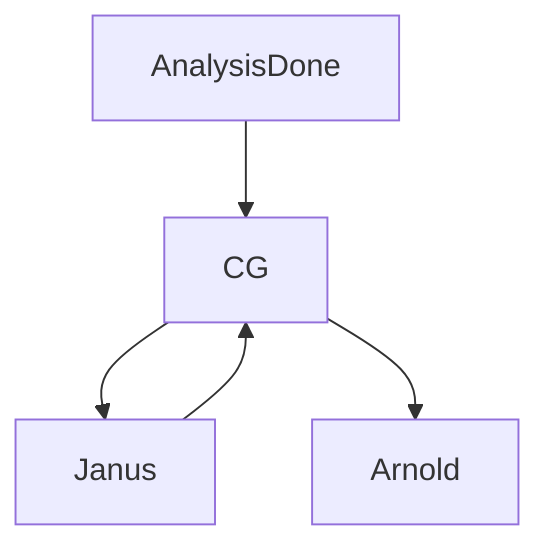

# For developers


## Overview of Janus Integration with CG

When an analysis has finished running it will produce multi qc files in json format for various tools. Janus is designed to be able to parse these intermediate multiqc json files for a given workflow.

Thus, when an analysis is finished CG will make a collect qc metrics call to Janus. Janus then collects the QC metrics for a case and sends a response back to CG with the payload. CG then passes on this information to Arnold to store it as a case document.




## How is Janus designed?

Janus has a single endpoint that other APIs can interact with: `api/v1/collect_qc`. This endpoint should receive information in the from of a CollectQCRequest.

```Python
class CollectQCRequest(BaseModel):
    """Model for the qc collection request."""
    case_id: str
    sample_ids: list[str]
    files: list[FilePathAndTag]
    workflow_info: WorkflowInfo

class WorkflowInfo(BaseModel):
    workflow: str
    version: str

class FilePathAndTag(BaseModel):
    """Model for the file path and its associated tag."""
    file_path: str
    tag: str

```

Using this request, Janus can then parse the proper files using the `FilePathAndTag` model with the `file_path` attribute. The `tag` attribute is used to fetch the proper parsing function that is required for the contents of the file from the given `file_path`

The attributes `case_id` and  `sample_id` are used to identify the case and samples for which to retrieve files for.

With this information in mind, take a look at the `CONTRIBUTING.md`.
Within that file the steps are listed to implement parsing of a new workflows with Janus.


## Adding new models and parsing functions to Janus

To add new parsing functionality to Janus:

1. Check if the file tag is represented in `constants/FileTag.py`.
2. Check if the parsing functions can parse the metrics file. See in fixtures for currently available structures.
3. Add a model to the `models/<metrics>` that will hold the parsed data if it is not already present. 
4. Add new or update an existing workflow model in `models/workflow`.
5. If there is a new workflow create a WorkflowCollectQCService in `services/workflow_collect_qc_service.py` that will handle the parsing of the workflow. This Service has to expose a `get_case_info()` function that takes a `CollectQCRequest` and returns a Workflow model.
6. Add the workflow and workflow-service combination to the `workflow_to_service` map.
7. Add/Update tests to ensure the parsing can be successful.